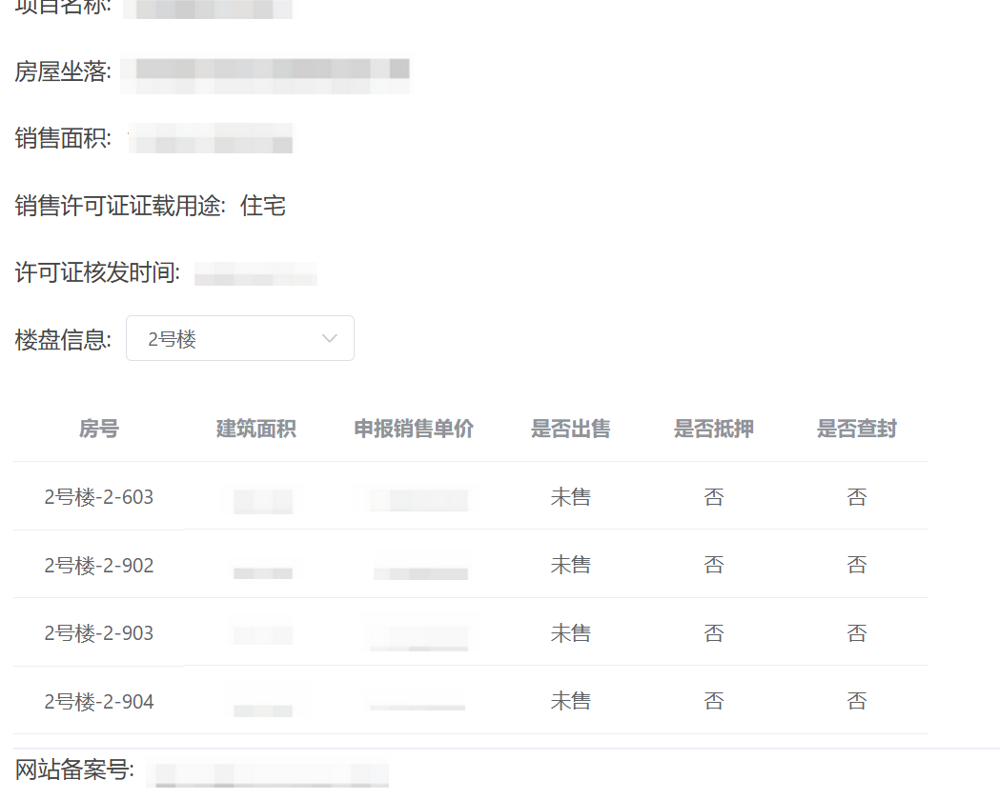
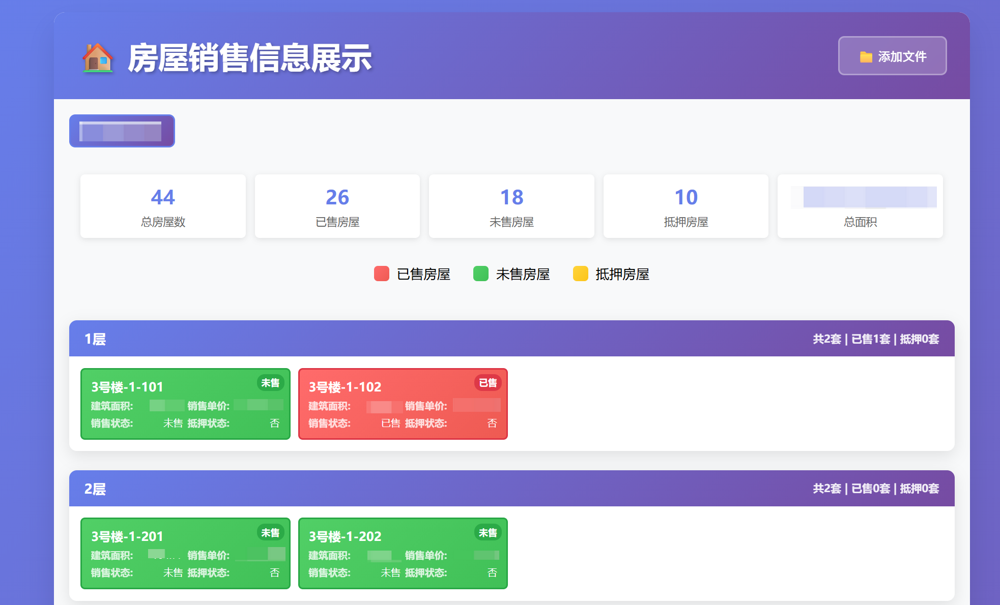

# 天津住建委新房销售数据展示优化


## 📁 项目文件

- `extract_house_sales.py` - 数据提取脚本
- `house_sales_display.html` - 可视化展示页面

## 📊 效果对比

### 原始界面


### 项目处理后的界面



## 🔄 工作流程
1. **下载数据**: 从天津市住建委官网进入楼盘信息页面，然后右键另存为到本地。
1. **数据提取**：使用Python脚本从HTML文件提取房屋信息。
2. **格式转换**：生成结构化的JSON数据文件。
3. **可视化展示**：通过HTML页面展示数据，支持楼层排序和状态涂色。


## 🚀 快速开始

### 1. 安装依赖

```bash
pip install beautifulsoup4
```

### 2. 下载数据

#### 📍 步骤详解

**第一步：访问官方网站**
- 打开浏览器，访问：https://zfcxjs.tj.gov.cn/ggfw_70/xxcx/spfxsxk/2025nxsxk/
- 这是天津市住建委官方的新房销售信息查询平台

**第二步：查找目标楼盘**
- 在页面中搜索需要查询的楼盘
- 点击楼盘名称进入详细信息页面

**第三步：获取二维码**
- 在搜索结果列表中，找到目标楼盘
- 在楼盘信息右侧找到"查看"按钮
- 点击后会显示一个二维码
- 扫描二维码进入移动端页面（支持以下方式）：
  - 🖥️ **浏览器插件**：安装二维码扫描插件，直接在电脑上扫描
  - 📷 **截图识别**：将二维码截图，使用在线二维码识别工具

**第四步：完成安全验证**
- 在页面输入安全验证码
- 验证通过后进入具体楼栋信息页面

**第五步：选择具体楼栋**
- 在楼栋列表中选择需要查询的具体楼栋
- 点击进入该楼栋的详细销售信息页面

**第六步：保存HTML文件**
- 在楼栋销售信息页面，右键点击页面空白处
- 选择"另存为"或"保存页面"将文件保存到本地


### 3. 提取数据

```bash
# 处理HTML文件并生成JSON
python extract_house_sales.py "xxx-3号楼.html"

# 指定输出格式
python extract_house_sales.py "xxx-3号楼.html" -o "xxx3号楼销售信息.json"
```

### 4. 可视化展示

1. 打开 `house_sales_display.html` 文件
2. 点击"选择JSON文件"按钮
3. 选择生成的JSON文件
4. 查看按楼层排序的房屋销售信息


## 🛠️ 技术栈

- **后端处理**：Python + BeautifulSoup4
- **前端展示**：HTML5 + CSS3 + JavaScript
- **数据格式**：JSON
